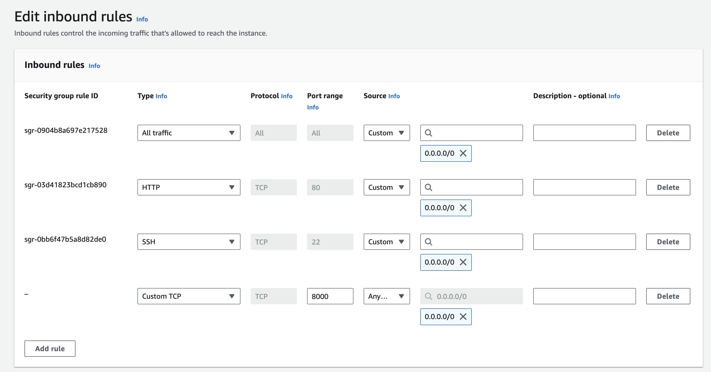

# datacamp-titanik
DataCamp 2023 Uçtan Uca Makine Öğrenmesi Modelleri &amp; FastAPI &amp; Docker Workshop Kodları

# Docker Image Build & Çalıştırma

Gerekli Docker kurulumları yapıldıktan ve kodlar makineye indirildikten sonra
```
# Kodların makineye indirilmesi
git clone https://github.com/beyz4n/titanic

# Docker image build
docker-compose build

# Docker image run
docker-compose up
```

İşlemlerden sonra localhost:8000/docs adresinden uygulamaya erişilebilir. 

# AWS üzerinde Canlıya Alma

- AWS üzerinde uygulamanın canlıya alınabilmesi için öncelikle [AWS EC2](https://us-east-1.console.aws.amazon.com/ec2/) servisi üzerinden 1GB RAM 1VCPU'ya sahip bir makine açılması gerekmektedir. Makine tipi olarak ücretsiz olduğu için t2.micro tercih edilebilir. 
- Ayarlar yapılırken security group ayarında bütün portlar(önerilmez veya fastapi uygulamasının yayınlanacağı porta erişim verilmesi gerekmektedir. Ayarlar ekteki görseldeki gibi yapılmalıdır.
  - 
- Makine açıldıktan sonra makineye ssh veya ec2-serial-console kullanılarak erişilebilir.
- Amazon makineleri yüksek ihtimalle python3 yüklü olarak gelmektedir. Eğer gelmediyse internet üzerinden Debian/Linux makinelere nasıl python yükleneceğine bakabilirsiniz.
- Makineye gerekli kodların çekilebilmesi için git yüklenir. 
```
# Root Yetkilerinin Alınması
sudo su

# AWS AMI
yum install git -y
yum install docker -y
sudo curl -L https://github.com/docker/compose/releases/latest/download/docker-compose-$(uname -s)-$(uname -m) -o /usr/local/bin/docker-compose
sudo chmod +x /usr/local/bin/docker-compose

# Docker servisinin restartlanması
systemctl restart docker
```

- Git yüklendikten sonra alttaki komut ile kodlar makineye çekilir.
```
git clone https://github.com/beyz4n/titanic
```

- Dosyaya gidilerek docker image'i build edilir.

```
cd datacamp-titanik

docker-compose build
```

- Build edilen docker image'i run edilir.
```
docker-compose up
```

Uygulama çalışınca makinenin public ipsinin 8501 portundan erişilebilir. 

```
# Örnek IP
X.X.X.X:8501
```
